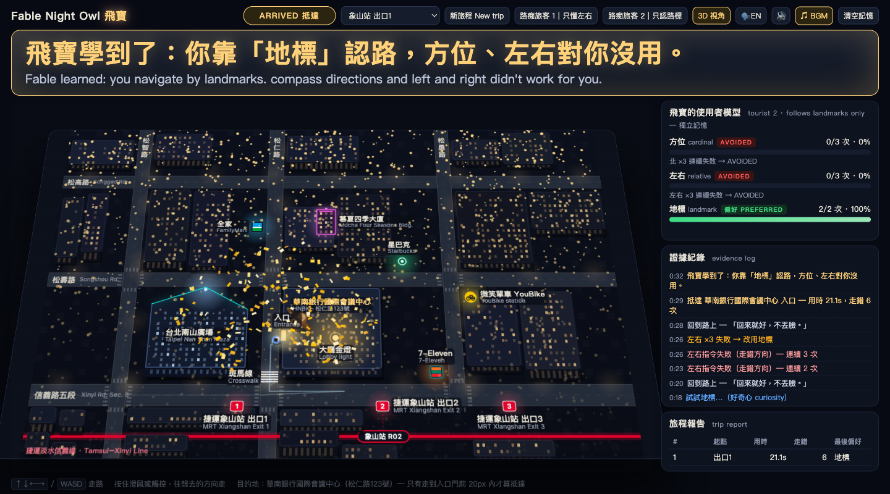
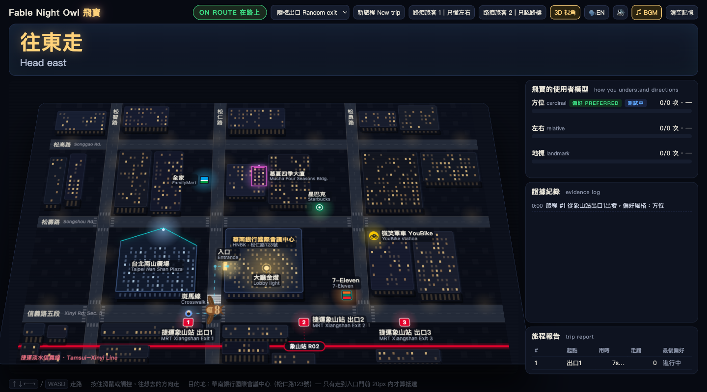

<div align="center">

# 🦉 Fable Night Owl 飛寶

**一隻會學習「你怎麼理解方向」的陪伴貓頭鷹。**
An owl companion that learns how *you* understand directions — because Google Maps gives up at the last 200 meters, and some of us never know where north is.

[](index.html)
[](#)
[](#)
[](#)
[](LICENSE)

[**▶ 直接開啟 index.html 就能玩**](index.html) · [功能](#-功能) · [快速開始](#-快速開始) · [運作原理](#-運作原理) · [Demo 流程](#-demo-流程)



<sub>抵達門口那一刻，飛寶說：「飛寶學到了：你靠『地標』認路，方位、左右對你沒用。」</sub>

</div>

---

## 為什麼做這個

導航 App 會把你帶到「那棟樓」，然後放棄你。真正迷路的是最後幾十公尺：哪一側是入口？「往北」對一個不知道北在哪的人毫無意義。

**飛寶不教你認路，它學你怎麼認路。** 每一句指令都是一次小實驗：你有沒有在 3–4 秒內往正確方向走？失敗三次，它就換一種說法。

## ✨ 功能

- **真實地景**：台北信義區華南銀行國際會議中心周邊的夜間俯視模型。信義路五段、松仁路、松勇路，捷運象山站三個出口，台北南山廣場、7-Eleven、全家、星巴克、YouBike、斑馬線、慕夏四季大廈、大廳金燈，全部是會發光的地標。
- **最後幾公尺才算到**：目的地不是那棟樓，是松仁路側那一扇門。門前 20px 內才算 ARRIVED。
- **三種說法，一個使用者模型**
  - 方位 cardinal：「往北走」
  - 左右 relative：「往你的左手邊」
  - 地標 landmark：「全家在你的右前方，跟著燈光走」（被提到的地標會脈動發光）
- **確定性學習**：每種說法都有成功率；連續失敗 3 次即標記 AVOIDED 並換一種。偏好是黏著的，不會因單次失敗就重排。每第 5 句指令花在最少用的說法上（好奇心），一分鐘內三種說法都會亮相。
- **即時糾正**：走錯約 1 秒，橫幅閃爍「走錯囉，沒關係！」，貓頭鷹在你和正確方向之間來回、拍翅、射出虛線。
- **兩位路痴旅客一鍵示範**：旅客 1 只懂左右、旅客 2 只認路標。切換即重置記憶，看飛寶從零學會怎麼跟每一位說話。
- **有聲音、有個性**：瀏覽器內建語音（英文 / 繁中可切換），換方式時輕輕鳴叫，抵達時暖鐘聲、170 片金色紙花與金粉從天而降。
- **旁邊就是證據**：每種說法一條成功率長條、證據紀錄（「北 ×3 失敗 → 改用左右」）、旅程報告，後一趟比第一趟快就變綠。
- **2.5D 夜景**：立體建築、透視傾斜、一點霓虹。一鍵切回平面。

<div align="center"></div>

## 🚀 快速開始

```bash
git clone https://github.com/k66inthesky/fable-night-owl-app.git
cd fable-night-owl-app
python3 -m http.server 8765
# 開 http://localhost:8765
```

沒有 build、沒有 npm、沒有外部資源。直接雙擊 `index.html` 也能玩，只是瀏覽器可能因 file:// 限制不播 BGM。

> 語音與音效需要先在頁面上點一下（瀏覽器的使用者手勢限制）。建議 Chrome 或 Safari；macOS 內建 zh-TW「美佳」與 en-US「Samantha」語音效果最好。

### 操作

| 動作 | 按鍵 |
|---|---|
| 走路 | `↑↓←→` / `WASD`，或按住滑鼠、觸控往想去的方向 |
| 路痴旅客 1（只懂左右） | `1` |
| 路痴旅客 2（只認路標） | `2` |
| 新旅程 | `N` |
| 清空記憶 | `R` |
| 語音靜音 | `M` |
| 3D / 平面、BGM、語音語言 | 標題列按鈕 |

只能走在馬路上，不能穿越街區。

## 🧠 運作原理

程式刻意分成兩個互不越界的平面：

```
┌────────────────────────────┐      ┌────────────────────────────┐
│ NavEngine  導航真值引擎     │      │ Guidance  說法層            │
│ · 街道圖 + Dijkstra         │ ───▶ │ · 只負責把「下一步」說出來   │
│ · waypoint 單向承諾，不回頭  │ next │ · 方位 / 左右 / 地標 三種   │
│ · 每幀分類：ON_ROUTE /      │ step │ · 找不到地標 → 退回左右，   │
│   WRONG_DIRECTION /         │      │   並記在左右，絕不記地標     │
│   OFF_ROUTE / RECOVERED /   │      │ · 從不計算路線              │
│   ARRIVED                   │      └────────────────────────────┘
│ · 偏離 > 250px → 從當前位置  │
│   重規劃，不繞回已過路口     │      ┌────────────────────────────┐
└────────────────────────────┘      │ UserModel  使用者模型        │
                                    │ · 每種說法：trials / success │
                                    │ · 3 連敗 → AVOIDED + 證據    │
                                    │ · 黏著偏好，只在 AVOIDED 時換 │
                                    │ · 每第 5 句 → 好奇心試最少用  │
                                    └────────────────────────────┘
```

- **WRONG_DIRECTION** = 還在正確的街上，但正在遠離下一個路口（往回走也算），約 1 秒後觸發糾正。
- **OFF_ROUTE** = 離開街道圖。
- **一句指令 = 一次 trial**：發出後 3.5 秒內沿正確方向前進 ≥ 26px 即成功；閒置的人類不算證據（計時從第一次移動開始），自動走者則嚴格計時。
- 自動走者依旅客設定「聽得懂」哪幾種說法；聽不懂的就走錯方向，讓學習過程在無人操作下自然浮現。

## 🎬 Demo 流程

1. 點一下畫面解鎖聲音。
2. 按 **2**（旅客 2，出口 1）：方位 ×3 失敗 → 換左右 → 左右 ×3 失敗 → 換地標 → 抵達、紙花、金句。約 20 秒。
3. 按 **R** 清空記憶，按 **1**（旅客 1）：方位 ×3 失敗 → 改用左右 → 12 秒抵達。
4. 指右側面板：成功率、證據紀錄、旅程報告。

## 🛠 技術

- 一個 `index.html`：HTML + CSS + Vanilla JS（約 1,000 行），Canvas 2D，60 fps
- 語音：Web Speech API `speechSynthesis`（zh-TW / en-US）
- 音效：Web Audio API 即時合成的鳴叫與鐘聲
- 動畫：Canvas 粒子（重力、旋轉、淡出），無任何圖片素材
- 3D：CSS `perspective` + `rotateX` 與 Canvas 內的 2.5D 拉高

## 🎵 致謝

- BGM《Digital Pulse》以 **Suno 6.1 mini** 生成。

- 地景取材自台北信義區真實街廓；建築與品牌名稱僅作為導航地標示意。
- 貓頭鷹是圓圓的棕色身體、耳羽、琥珀色大眼、會拍的翅膀。從來不是一顆會發光的球。

## 🌙 Build Day

> 🦉 **關於這次 Build**：這個專案是在 [Taipei | Claude Code Build Day](https://lu.ma/) 的 90 分鐘限時現場中，用 Fable 5.1 一次生成出來的——事前沒有寫好的半成品。
>
> - 主辦：Claude Community Taiwan · 賽道：Delight
> - 時間：2026 年 9 月 20 日 17:00–22:00
> - 地點：華南銀行國際會議中心 HNBK International Convention Center，台北市信義區松仁路 123 號 2 樓
>
> 完整的原始 prompt 放在 [`PROMPT.md`](PROMPT.md)——這份文件是「輸入」，`index.html` 是 Fable 5.1 當場給出的「輸出」。

## 📄 License

[MIT](LICENSE)
